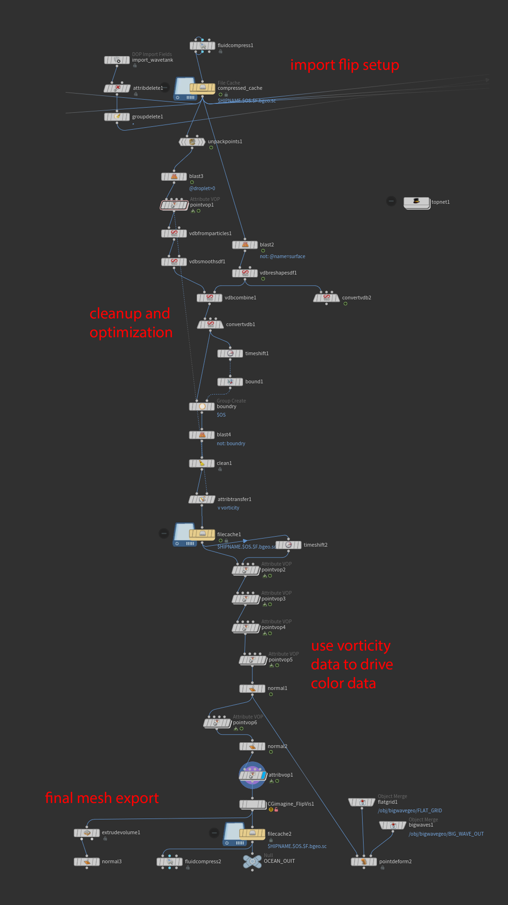
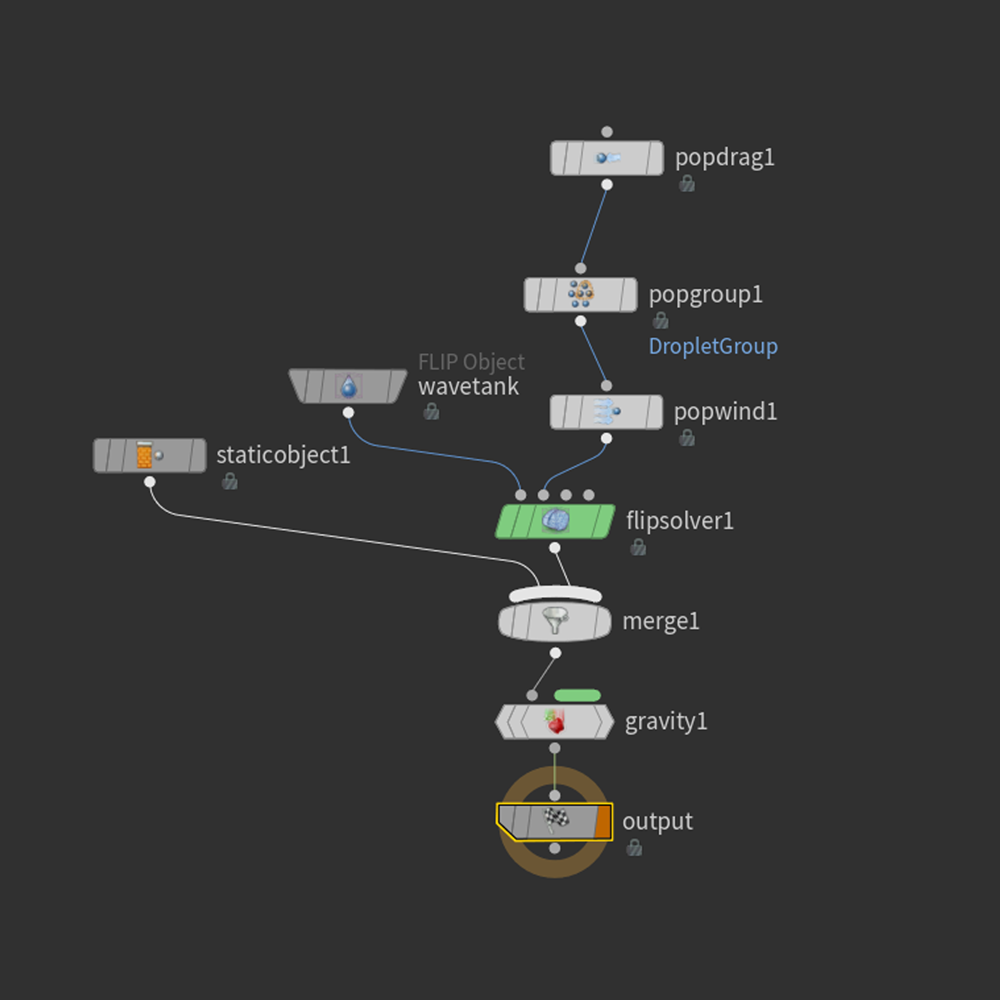
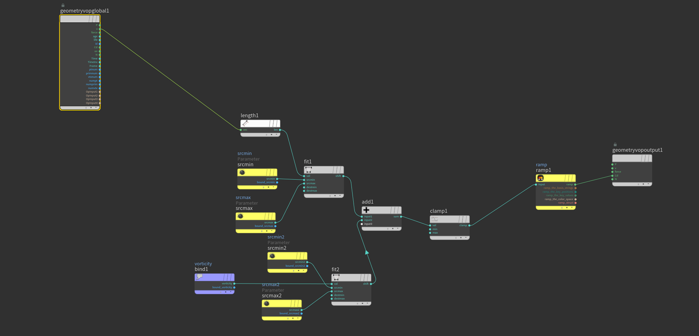

# Stylized Paper Boat FLIP Simulation

A stylized water simulation project featuring a paper boat floating on a dynamic water surface, created in Houdini and rendered with Redshift.


## 🎯 Project Overview

This project demonstrates a non-photorealistic approach to fluid simulation, focusing on artistic style over physical accuracy. The simulation uses velocity and vorticity data to drive color attributes, creating a stylized white water effect without the computational overhead of traditional particle-based white water simulations.

## 📋 Technical Specifications

- **Software:** SideFX Houdini (FLIP Solver) + Redshift Renderer
- **Total Point Count:** 4,936,543
- **Cache Time:** 45 minutes
- **Hardware:** RTX 3080 GPU
- **Simulation Type:** FLIP Tank with POP Wind forces


## 🚀 Getting Started

### Prerequisites
- SideFX Houdini (tested on H19.5+)
- Redshift for Houdini
- 8GB+ GPU memory recommended

### Setup Instructions

1. **Clone the repository:**
   ```bash
   git clone https://github.com/yourusername/stylized-paper-boat-flip.git
   cd stylized-paper-boat-flip
   ```

2. **Open the main simulation file:**
   ```
   houdini files/Stylized_boat_render.hipnc
   ```

3. **Cache the simulation:**
   - Navigate to the FLIP solver
   - Set cache path to your local directory
   - Run simulation (45 minutes on RTX 3080)

4. **Render setup:**
   - Open `paper_boat_render.hip`
   - Update cache paths if needed
   - Configure Redshift render settings

## 🎨 Key Features

### Stylized Approach
- **Velocity-driven coloring** instead of white water particles
- **Vorticity + velocity mapping** for foam-like appearance
- **Non-photorealistic rendering** optimized for artistic output

### Technical Implementation
- **VDB collision setup** for stable boat-water interaction
- **AttributeVOP network** for color attribute generation
- **POP Wind forces** for natural wave motion
- **Optimized for computation** - 45min cache time

### Asset Pipeline
- **Substance Painter texturing** with stylized normal map techniques
- **Brush-painted normals** for handcrafted paper aesthetic
- **Collision-ready geometry** with proper thickness

## 📊 Simulation Breakdown

### FLIP Tank Configuration
- Standard FLIP solver setup
- Paper boat as collision object
- Edge selection prepared for larger wave integration


## 🎯 Usage Examples

### For Learning
- Study velocity-based color techniques
- Understand stylized simulation approaches
- Learn VDB collision setup methods

### For Production
- Adapt color mapping for different fluid types
- Scale setup for larger simulations
- Integrate with existing pipeline workflows

## 🔧 Customization

### Adjusting Wave Motion
- Modify POP Wind force strength
- Adjust FLIP solver substeps
- Change tank dimensions

### Color Variations
- Edit ramp values in AttributeVOP network
- Experiment with different velocity thresholds
- Try alternative color combinations

### Performance Tuning
- Reduce particle separation for faster simulation
- Adjust voxel size for memory optimization
- Modify substep count for quality vs speed

## 📈 Performance Notes

- **Cache Size:** ~2GB for full simulation
- **Memory Usage:** 6-8GB GPU memory
- **Render Time:** 2-3 minutes per frame (1080p)
- **Optimization:** Velocity coloring saves 60% compute time vs white water


## 🙏 Acknowledgments

- SideFX for Houdini
- Maxon for Redshift
- Community tutorials and resources


⭐ **If you found this project helpful, please consider giving it a star!**






## 🖼️ Gallery
